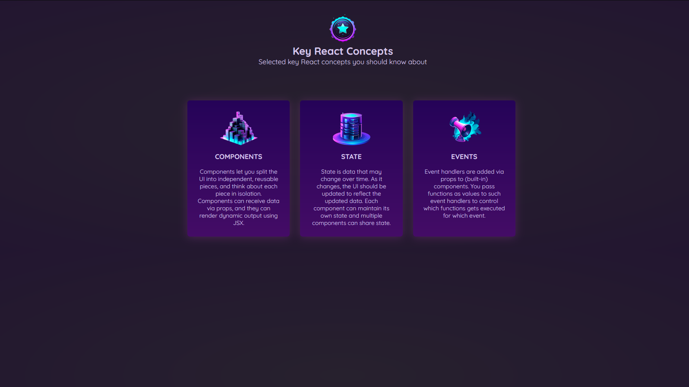

# Key Concepts

This project, titled 'Key Concepts', is a visual and interactive way to understand complex coding concepts. Dive into it with\*\*.

## Getting Started

To get the project up and running on your local machine, follow these steps:

1. Clone the repository from GitHub:
   _`bash`_`
   git clone https://github.com/Vilasi/key-concepts.git

- cd key-concepts
- npm install
- npm start

The project will now start on LocalHost port 3000

## How It's Made:

**Tech used:** HTML, CSS, JavaScript, ReactJS

The application is built using ReactJS to create a dynamic and interactive UI. The backend is handled by Node.js and Express.js, making the data retrieval process smooth. The project also utilizes MongoDB for storing and managing data. Mongoose.js is used as an ODM to manage relationships between data, provide schema validation, and used to translate between objects in code and the representation of those objects in MongoDB.

The UI is designed to be intuitive and user-friendly, making the learning process engaging and less intimidating. Each concept is broken down into smaller, digestible chunks with visual representations to aid understanding. The interactive quizzes and real-time feedback provide a hands-on learning experience.

## Optimizations

The initial implementation was further optimized to enhance performance and user experience. Assets are cached to speed up load times, and code splitting techniques were employed to lazy-load components, thus reducing the initial load time. Additionally, the MongoDB queries were optimized to reduce the data retrieval time, and indexes were created to speed up the database search operations. This resulted in a faster, more efficient application that provides an enjoyable user experience.
